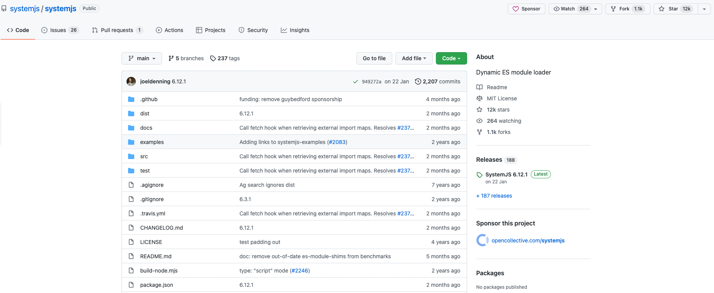

# 1、微前端概述

## 1.1 什么是微前端

微前端是一种软件架构，可以将前端应用拆解成一些更小的能够独立开发部署的微型应用，然后再将这
些微应用进行组合使其成为整体应用的架构模式。
微前端架构类似于组件架构，但不同的是，组件不能独立构建和发布，但是微前端中的应用是可以的。
微前端架构与框架无关，每个微应用都可以使用不同的框架。

## 1.2 微前端的价值
**增量迁移**

**独立发布**

**允许单个团队做出技术决策**

因为微前端构架与框架无关，当一个应用由多个团队进行开发时，每个团队都可以使用自己擅长的技术栈进行开发，也就是它允许适当的让团队决策使用哪种技术，从而使团队协作变得不再僵硬。

### 微前端的使用场景

1. 拆分巨型应用，使应用变得更加可维护
2. 兼容历史应用，实现增量开发

## 1.3 多个微应用如何进行组合 ?

1. 多个微应用如何进行组合 ?
   在微前端架构中，除了存在多个微应用以外，还存在一个容器应用，每个微应用都需要被注册到容 器应用中。 微前端中的每个应用在浏览器中都是一个独立的 JavaScript 模块，通过模块化的方式被容器应用启 动和运行。 使用模块化的方式运行应用可以防止不同的微应用在同时运行时发生冲突。
2. 在微应用中如何实现路由 ？
   在微前端架构中，当路由发生变化时，容器应用首先会拦截路由的变化，根据路由匹配微前端应用，当匹配到微应用以后，再启动微应用路由，匹配具体的页面组件。
3. 微应用与微应用之间如何实现状态共享 ?
   在微应用中可以通过发布订阅模式实现状态共享，比如使用 RxJS。 
4. 微应用与微应用之间如何实现框架和库的共享？ 
   通过 import-map 和 webpack 中的 externals 属性。

# 2、SystemJS模块化解决方案

## 社区活跃度



## 使用体验

通过 webpack 将 react 应用打包为 systemjs 模块，在通过 systemjs 在浏览器中加载模块。
比较类似`RequireJS`只是 `RequireJS`是基于AMD规范，是一个模块加载的插件。SystemJS是一个基于的自己的模块规范。

如果我们在很多项目中有公用的插件需要打包时排除`externals: ["react", "react-dom", "react-router-dom"]`并将
公共模块添加到`<script type="systemjs-importmap">`中进行引用。个人感觉属于半自动化，我们共享组件时如果修改了
需要再去打包另一个项目的公共插件然后再放到项目中会比较麻烦。

### 示例代码

```js
const path = require("path")
const HtmlWebpackPlugin = require("html-webpack-plugin")

module.exports = {
  mode: "development",
  entry: "./src/index.js",
  output: {
    filename: "index.js",
    path: path.join(__dirname, "build"),
    libraryTarget: "system"
  },
  devtool: "source-map",
  devServer: {
    port: 9000,
    contentBase: path.join(__dirname, "build"),
    historyApiFallback: true
  },
  module: {
    rules: [
      {
        test: /\.js$/,
        exclude: /node_modules/,
        use: {
          loader: "babel-loader",
          options: {
            presets: ["@babel/preset-env", "@babel/preset-react"]
          }
        }
      }
    ]
  },
  plugins: [
    new HtmlWebpackPlugin({
      template: "./src/index.html",
      inject: false
    })
  ],
  externals: ["react", "react-dom", "react-router-dom"]
}

```

```js
<!DOCTYPE html>
<html>
<head>
  <meta charset="utf-8">
  <meta http-equiv="X-UA-Compatible" content="IE=edge">
  <title>SystemJS AMD Modules from CDN Example</title>
  <meta name="viewport" content="width=device-width, initial-scale=1">
  <script type="systemjs-importmap">
    {
      "imports": {
        "react": "https://cdn.jsdelivr.net/npm/react/umd/react.production.min.js",
        "react-dom": "https://cdn.jsdelivr.net/npm/react-dom/umd/react-dom.production.min.js"
      }
    }
  </script>
  <script src="https://cdn.jsdelivr.net/npm/systemjs/dist/system.min.js"></script>
</head>
<body>
  <div id="react-root"></div>
  <script type="systemjs-module" src="./dist/react-hello-world.js"></script>
</body>
</html>
```

# 3、基于`qiankun` `single-spa`实现微前端

## 3.1 概述

`qiankun` 是一个基于 `single-spa` 的微前端实现库，旨在帮助大家能更简单、无痛的构建一个生产可用微前端架构系统。这两个微前端框架用法比较
类似，提供的Api和`single-spa`是类似。模块加载基于`system.js`。

- 基于 single-spa 封装，提供了更加开箱即用的 API。
- 📱 技术栈无关，任意技术栈的应用均可 使用/接入，不论是 React/Vue/Angular/JQuery 还是其他等框架。
- 💪 HTML Entry 接入方式，让你接入微应用像使用 iframe 一样简单。
- 🛡​ 样式隔离，确保微应用之间样式互相不干扰。
- 🧳 JS 沙箱，确保微应用之间 全局变量/事件 不冲突。
- ⚡️ 资源预加载，在浏览器空闲时间预加载未打开的微应用资源，加速微应用打开速度。
- 🔌 umi 插件，提供了 @umijs/plugin-qiankun 供 umi 应用一键切换成微前端架构系统。

## 3.2qiankun实现

```shell
$ git clone https://github.com/umijs/qiankun.git
$ cd qiankun

$ yarn install
$ yarn examples:install
$ yarn examples:start
```

## 3.3single-spa实现

### single-spa 概述

single-spa 是一个实现微前端架构的框架。
在 single-spa 框架中有三种类型的微前端应用：
1. single-spa-application / parcel：微前端架构中的微应用，可以使用 vue、react、angular 等框架。
2. single-spa root config：创建微前端容器应用。
3. utility modules：公共模块应用，非渲染组件，用于跨应用共享 javascript 逻辑的微应用。

### 创建容器应用

1. 安装 single-spa 脚手架工具： npm install create-single-spa@2.0.3 -g
2. 创建微前端应用目录： mkdir application && cd "$_" 
3. 创建微前端容器应用： create-single-spa 
    - 应用文件夹填写 container
    - 应用选择 single-spa root config
    - 组织名称填写 ebk
    - 组织名称可以理解为团队名称，微前端架构允许多团队共同开发应用，组织名称可以标识应用由哪个团队开发。
    - 应用名称的命名规则为 @组织名称/应用名称 ，比如 @ebk/todos 
4. 启动应用： npm start 
5. 访问应用： localhost:9000

### 创建基于 Vue 的微应用

1. 创建应用： create-single-spa 
- 项目文件夹填写 product
- 框架选择 Vue
- 生成 Vue 2 项目

**将公用的代码提取不打包到项目中，可以通过CDN方式引用**

```js
// vue.config.js
module.exports = { chainWebpack: config => { config.externals(["vue", "vue-router"]) } }
```

# 4、基于模块联邦的微应用

## 应用初始化

使用`Vue cli`的脚手架工具创建容器应用（我们的技术栈是vue这里介绍vue项目的微应用开发），启动应用`yarn serve`，这时我们就可以看到我们的应用以及可以访问。

## 4.1 模块联邦概述

Module Federation 即为模块联邦，是 Webpack 5 中新增的一项功能，可以实现跨应用共享模块。
Runtime 的方式可能是 UMD 方式共享代码模块，即将模块用 Webpack UMD 模式打包，并输出到其他项目中，运行时加载模块进行页面渲染。


## 4.2 共享模块

### 实现模块共享

在 Product 和 Auth 中都需要同一个组件的时候， Container 加载了这两个模块后，他们使用的模块会被加载了两次。

```shell
// 分别在 Products 和 Cart 的 webpack 配置文件中的模块联邦插件中添加以下代码
{ 
  shared: ["模块名称"] 
}
```

注意：共享模块需要异步加载，需要添加 bootstrap.js
### 共享模块版本冲突解决 
如果使用 4.1.0 版本的 faker，例如 product 中使用 5.2.0 版本的 faker，通过查看网络控制面板可以发现 faker 又会被加载了两次，模块共享失败。
解决办法是分别在 faker，product 和 cart 中的 webpack 配置中加入如下代码

```sh
shared: { faker: { singleton: true } }
```

但同时会在原本使用低版本的共享模块应用的控制台中给予警告提示

### 开放子应用挂载接口

在容器应用导入微应用后，应该有权限决定微应用的挂载位置，而不是微应用在代码运行时直接进行挂载。所以每个微应用都应该导出一个挂载方法供容器应用调用。

```js
exposes: {
 "./HelloWorld": "./src/components/HelloWorld",
 "./ProductApp": "./src/bootstrap.js",
},
```

# 错误信息

### ScriptExternalLoadError: Loading script failed
```sh
app.js:29 Uncaught (in promise) ScriptExternalLoadError: Loading script failed.
(missing: http://localhost:9001/remoteEntry.js)
while loading "./HelloWorld" from webpack/container/reference/product
    at Object.webpack/container/reference/product (app.js:29:25)
    at __webpack_require__ (app.js:71:33)
    at initExternal (app.js:381:28)
    at Function.__webpack_require__.I (app.js:393:15)
    at app.js:867:47
    at Object.webpack/sharing/consume/default/vue/vue (app.js:921:76)
    at app.js:948:56
    at Array.forEach (<anonymous>)
    at Object.__webpack_require__.f.consumes (app.js:931:36)
    at app.js:186:40

    chainWebpack: (config) => {
    // 移除splitChunks，使用时无法找到模块
    config.optimization.delete("splitChunks");
    /* module federation plugin import */
    config.plugin("module-federation-plugin").use(ModuleFederationPlugin, [
      {
        name: "container",
        filename: "remoteEntry.js",
        remotes: {
          auth: "auth@http://localhost:9002/remoteEntry.js",
          product: "product@http://localhost:9001/remoteEntry.js",
        },
        shared: require("./package.json").dependencies,
      },
    ]);
  }
```

## 数据、方法共享
组件在容器也有数据共享，子模块可以导入容器应用数据或者模块
## 样式隔离
为了避免Css同名需要为样式加前缀或者作用域
## Css按需加载
Css打包我们之前的项目会将所有的样式放在一个一起最后这样会导致加载过程中全量加载，将Css拆分为
模块按需加载只会在访问对应模块加载对应的Css。